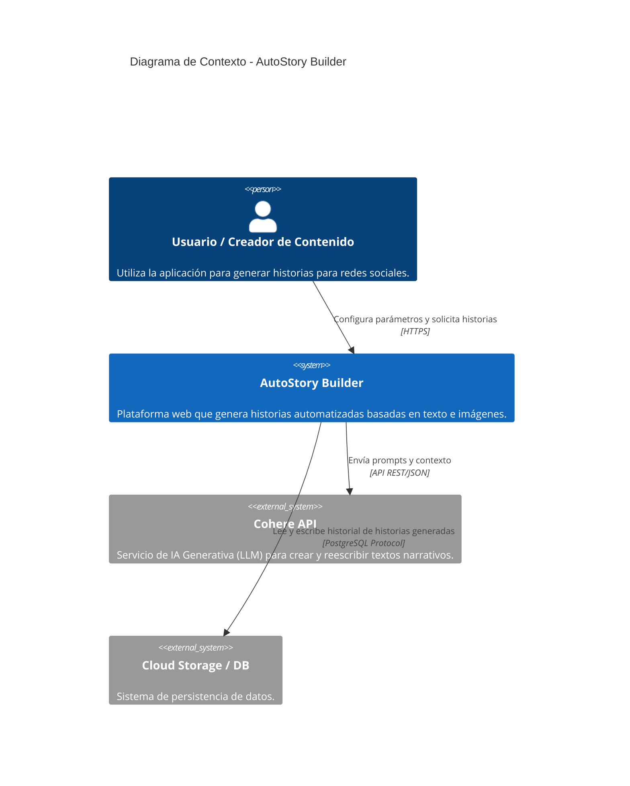
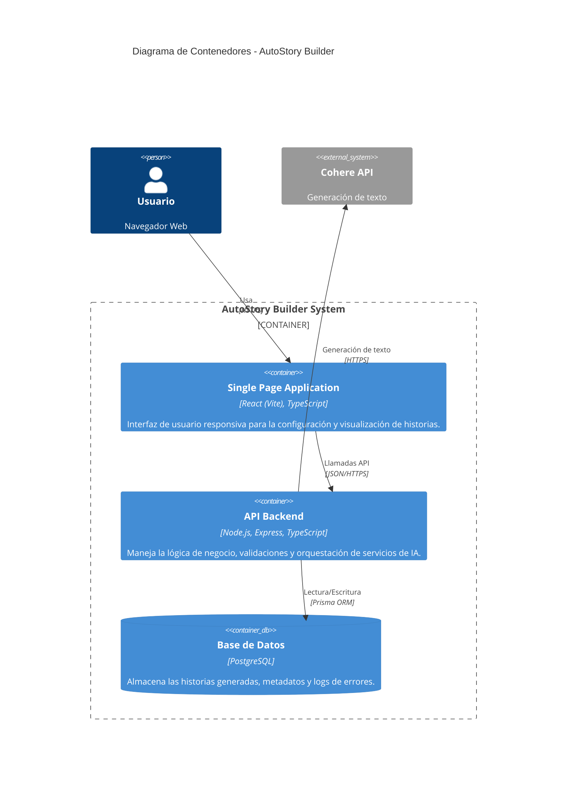

# Documentación de Arquitectura de AutoStory Builder

Esta documentación proporciona una visión técnica de alto nivel de la arquitectura del sistema **AutoStory Builder**, utilizando el modelo C4 para describir el contexto y los contenedores del sistema.

## 1. Diagrama de Contexto (Nivel 1)

Este diagrama muestra cómo **AutoStory Builder** interactúa con sus usuarios y sistemas externos.

## 2. Diagrama de Contenedores (Nivel 2)

Este diagrama profundiza en el sistema para mostrar los contenedores (aplicaciones ejecutables) que lo componen y sus interacciones.

## 3. Descripción de Componentes

### Frontend (SPA - Single Page Application)
*   **Tecnología**: React, Vite, TailwindCSS (presumiblemente).
*   **Responsabilidad**:
    *   Presentar el formulario de entrada (tono, formato, inputs de texto/imagen).
    *   Gestionar el estado de la aplicación.
    *   Mostrar la historia generada al usuario.
    *   Manejar la comunicación con el Backend.

### Backend (API REST)
*   **Tecnología**: Node.js, Express, TypeScript.
*   **Responsabilidad**:
    *   **Validación**: Asegura que los datos de entrada cumplan con los requisitos (longitud, tipos).
    *   **Orquestación**: Construye los prompts adecuados para la IA.
    *   **Integración**: Se comunica con la API de Cohere.
    *   **Persistencia**: Guarda el historial de creaciones en PostgreSQL mediante Prisma.

### Base de Datos
*   **Tecnología**: PostgreSQL.
*   **Esquema Principal**:
    *   `Story`: Almacena el ID, texto de entrada, configuración (tono/formato), el resultado generado y timestamps.

### Servicios Externos
*   **Cohere API**: Proveedor de LLM (Large Language Model) utilizado para la generación creativa de texto.

## 4. Despliegue (Infraestructura)

El sistema está preparado para ser desplegado en entornos modernos de nube.

*   **Contenerización**: Uso de **Docker** para empaquetar el backend y asegurar consistencia entre desarrollo y producción.
*   **Orquestación Local**: `docker-compose` para levantar base de datos y backend simultáneamente en entornos de desarrollo.
*   **Nube (Producción)**: Configuración lista para **Render** (vía `render.yaml`) o plataformas similares.

 
