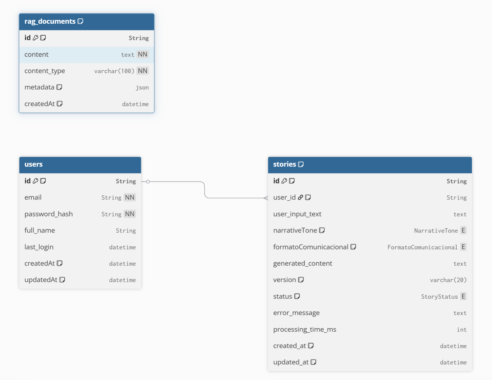

# Diccionario de Datos - Sistema de Generación de Historias

## Enumeraciones (Enums)

### NarrativeTone
Define el tono narrativo que se aplicará al contenido generado.

| Valor | Descripción |
|-------|-------------|
| INSPIRACIONAL | Tono motivador y emotivo, orientado a inspirar al lector |
| EDUCATIVO | Tono didáctico e informativo, enfocado en enseñar |
| TECNICO | Tono formal y especializado, con terminología técnica |

### FormatoComunicacional
Determina el formato de salida del contenido generado.

| Valor | Descripción |
|-------|-------------|
| HISTORIA | Formato de narrativa extendida o storytelling |
| POST | Formato de publicación tipo blog o artículo |
| REDES_SOCIALES | Formato optimizado para plataformas sociales (breve, directo) |

### StoryStatus
Indica el estado del procesamiento de la historia.

| Valor | Descripción |
|-------|-------------|
| GENERADO | Historia creada por primera vez exitosamente |
| REGENERADO | Historia que ha sido procesada nuevamente |
| EDITADO | Historia que ha sido modificada manualmente |

---

## Tablas

### users
Almacena la información de los usuarios del sistema.

| Campo | Tipo | Restricciones | Descripción |
|-------|------|---------------|-------------|
| id | String (UUID) | PK, Default: uuid() | Identificador único del usuario |
| email | String | UNIQUE, NOT NULL | Correo electrónico para autenticación |
| password_hash | String | NOT NULL | Hash de la contraseña (nunca se almacena en texto plano) |
| full_name | String | NULL | Nombre completo del usuario |
| last_login | DateTime | NULL | Fecha y hora del último acceso al sistema |
| createdAt | DateTime | Default: now() | Fecha de registro del usuario |
| updatedAt | DateTime | Auto-update | Última modificación del registro |

**Relaciones:**
- Tiene múltiples registros en `stories` (uno a muchos)

---

### stories
Tabla central que almacena las historias generadas y su metadata.

| Campo | Tipo | Restricciones | Descripción |
|-------|------|---------------|-------------|
| id | UUID | PK, Default: uuid() | Identificador único de la historia |
| user_id | String | FK → users.id, NULL, Indexed | Usuario propietario de la historia |
| user_input_text | String | NULL | Texto original proporcionado por el usuario |
| narrativeTone | NarrativeTone | Default: INSPIRACIONAL | Tono narrativo seleccionado |
| formatoComunicacional | FormatoComunicacional | Default: REDES_SOCIALES | Formato de salida elegido |
| generated_content | Text | NULL | Contenido generado por el sistema |
| version | VarChar(20) | Default: "1.0", Indexed | Control de versiones del contenido |
| status | StoryStatus | Default: GENERADO, Indexed | Estado actual de la historia |
| error_message | Text | NULL | Mensaje de error si el procesamiento falló |
| processing_time_ms | Integer | NULL | Tiempo de procesamiento en milisegundos |
| created_at | Timestamptz | Default: now(), Indexed | Fecha de creación con zona horaria |
| updated_at | Timestamptz | Auto-update | Última actualización con zona horaria |

**Índices:**
- `user_id`: Para búsquedas por usuario
- `version`: Para filtrar por versiones
- `status`: Para consultas por estado
- `created_at`: Para ordenamiento cronológico

**Relaciones:**
- Pertenece a `users` (muchos a uno, opcional)

---

### rag_documents
Almacena documentos para el sistema RAG (Retrieval-Augmented Generation).

| Campo | Tipo | Restricciones | Descripción |
|-------|------|---------------|-------------|
| id | String (UUID) | PK, Default: uuid() | Identificador único del documento |
| content | Text | NOT NULL | Contenido textual del documento |
| content_type | String | NOT NULL, Indexed | Tipo de contenido (ej: markdown, pdf, texto) |
| metadata | JSON | Default: {} | Información adicional en formato JSON flexible |
| createdAt | DateTime | Default: now() | Fecha de ingesta del documento |

**Índices:**
- `content_type`: Para filtrar documentos por tipo

**Uso:** Esta tabla soporta la funcionalidad de generación aumentada por recuperación, almacenando conocimiento base que puede ser consultado durante la generación de historias.

---

## Relaciones del Modelo

```
users (1) ──────< (N) stories
```

- Un usuario puede tener múltiples historias
- Una historia puede existir sin usuario asignado (user_id NULL)
- La tabla `rag_documents` es independiente y no tiene relaciones directas

---

## Notas Técnicas

**Fase del Proyecto:** Fase 3 - Sistema de generación narrativa con IA

**Consideraciones:**
- Los UUIDs garantizan identificadores únicos globales
- Las contraseñas se almacenan hasheadas por seguridad
- Los timestamps incluyen zona horaria (Timestamptz)
- La metadata en JSON permite flexibilidad para evolución futura
- Los índices optimizan consultas frecuentes por usuario, fecha y estado
-  Diagrama Entidad Relacion 